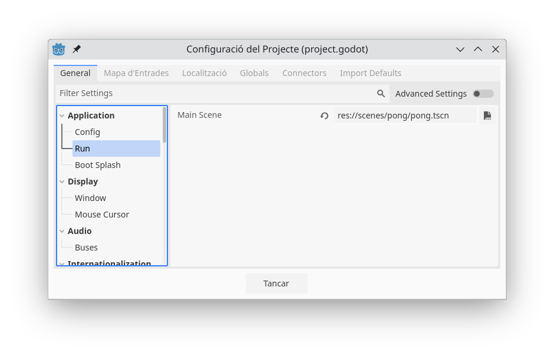
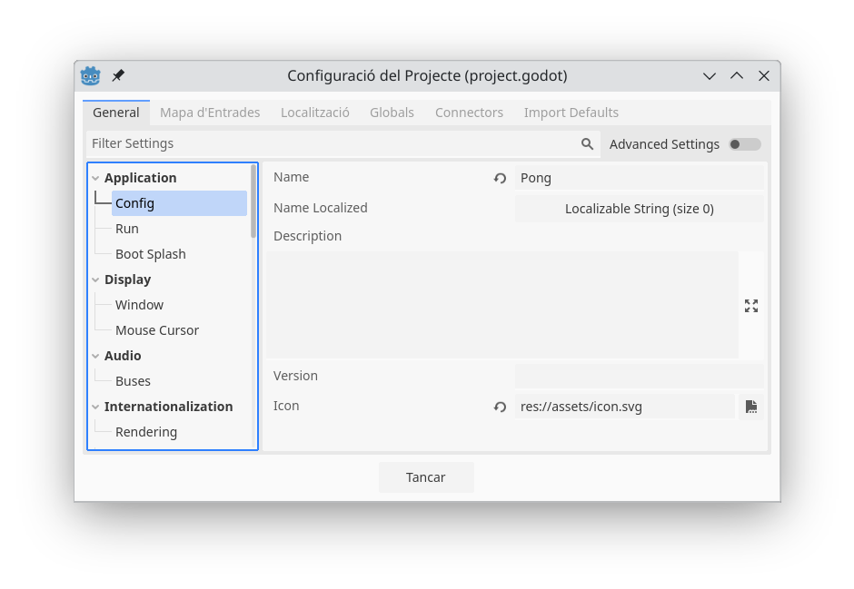
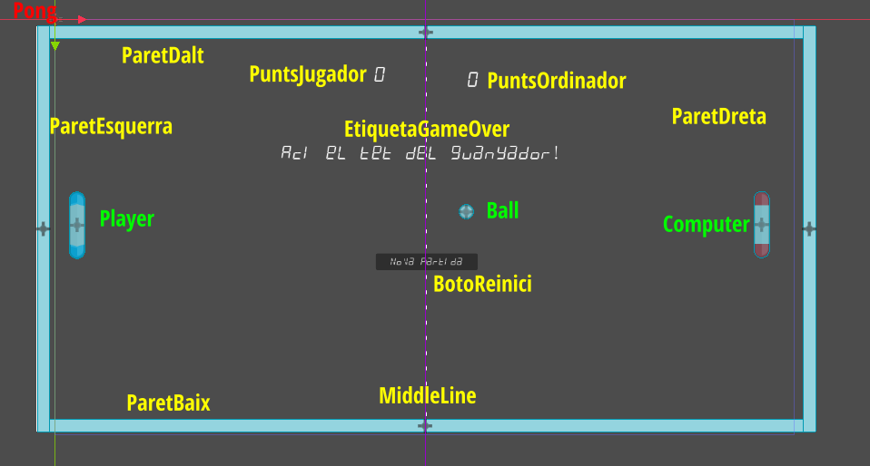
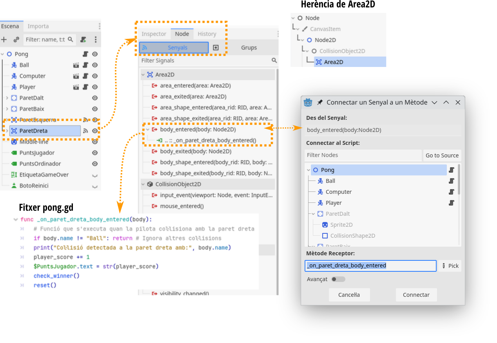
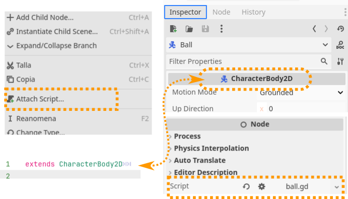

## Introducció

Anem a analitzar el funcionament i l'estructura del *projecte de Pong*, prestant atenció especial als conceptes més bàsics com nodes, escenes, senyals, o la gestió d'estat d'un joc bàsic.

Farem ús de Godot 4.3, d'on podem trobar la documentació al lloc oficial [Godot 4.x Documentation](https://docs.godotengine.org/es/4.x/).

El videotutorial de base el teniu a [Youtube](https://www.youtube.com/watch?v=YCTPNRw1EXo), i el repositori [Git original també està disponible](https://github.com/indierama/PongTutorial/tree/main), encara que incomplet i per a Godot 4.1.

## Estructura general del projecte

El projecte es compon principalment de les carpetes `assets` i `scenes`, organitzades d'aquesta manera:

```
├── assets
│   ├── alarm clock.ttf
│   ├── alarm clock.ttf.import
│   ├── ball.png
│   ├── ball.png.import
│   ├── icon.svg
│   ├── icon.svg.import
│   ├── middle-line.png
│   ├── middle-line.png.import
│   ├── paddle-blue.png
│   ├── paddle-blue.png.import
│   ├── wall-horizontal.png
│   ├── wall-horizontal.png.import
│   ├── wall-vertical.png
│   └── wall-vertical.png.import
├── project.godot
└── scenes
    ├── ball
    │   ├── ball.gd
    │   └── ball.tscn
    ├── computer
    │   ├── computer.gd
    │   ├── computer.tscn
    │   └── player2.gd
    ├── paddle-red.png
    ├── paddle-red.png.import
    ├── player
    │   ├── player.gd
    │   └── player.tscn
    └── pong
        ├── pong.gd
        └── pong.tscn

```

El fitxer que defineix tot el projecte és `project.godot`, el qual, defineix l'escena principal o *Main Scene* del joc, en aquest cas `res://scenes/pong/pong.tscn`), així com la configuració bàsica d'aquest, com la versió o el motor de renderitzat:

```
config_version=5

[application]

config/name="Pong"
run/main_scene="res://scenes/pong/pong.tscn"
config/features=PackedStringArray("4.3", "Forward Plus")
config/icon="res://assets/icon.svg"
```

Tot i ser un fitxer de text, el més comú és que el modifiquem des del propi editor:

* Per seleccionar l'escena principal, selecccionem del menú *Project > Project Settings*, per obrir la finestra de configuració del projecte, i busquem l'opció *Application > Run*. Des d'aci podrem seleccionar l'escena principal:



* Per altra banda, si volem canviar la icona de l'aplicació per a que no siga la icona de Godot podem fer-ho des d'aquesta mateixa finestra, en la secció *Application > Config > Icon*:



### Escena principal: `pong.tscn`

Aquesta fitxer és la "porta d’entrada" del joc. Quan executem el projecte, Godot obrirà aquesta escena.

- Conté les entitats principals: la pilota (Ball), el jugador (Player), el contrincant (Computer o Player2, que podrem configurar després), les parets (dalt, baix, esquerra i dreta), i diversos nodes de tipus `Label` i `Button` per als textos informatius o de reinici.

### Escenes secundàries

Recordeu que en Godot tot s'organitza en *escenes*, que podem reutilitzar com a nodes dins d'altres escenes.

- **`ball.tscn`**: Defineix l’objecte pilota.
- **`computer.tscn`**: Defineix la pala controlada per l’ordinador (o pel jugador 2 si canviem l'script que la controla).
- **`player.tscn`**: Defineix la pala del jugador 1.

## Nodes i escenes en Godot

En Godot, cada **escena** és una col·lecció de **nodes** amb un node *arrel* principal (per exemple, `Node2D`, `CharacterBody2D`, etc.). Les escenes es poden **instanciar** unes dins d’altres.

- **Node2D**: Node base per a objectes 2D.
- **CharacterBody2D**: Node pensat per gestionar objectes que es mouen i detecten col·lisions de forma fàcil amb funcions com `move_and_collide` o `move_and_slide`.
- **StaticBody2D** o **Area2D**: Nodes per a gestionar col·lisions estàtiques o zones que detecten col·lisions sense moure’s.

Documentació oficial:
- [Nodes i escenes a Godot 4.x](https://docs.godotengine.org/es/4.x/getting_started/step_by_step/index.html)  
- [Tipus de nodes 2D](https://docs.godotengine.org/es/4.x/tutorials/2d/index.html)

## L’escena principal `pong.tscn`

Si obrim l'escena en un editor veurem que es compon de diversos nodes:

```plaintext
[node name="Pong" type="Node2D"]
script = ExtResource("pong.gd")

[node name="Ball" ...]
[node name="Computer" ...]
[node name="Player" ...]
[node name="ParetDalt" type="StaticBody2D" ...]
[node name="ParetBaix" type="StaticBody2D" ...]
[node name="ParetEsquerra" type="Area2D" ...]
[node name="ParetDreta" type="Area2D" ...]
[node name="PuntsJugador" type="Label"]
[node name="PuntsOrdinador" type="Label"]
[node name="EtiquetaGameOver" type="RichTextLabel"]
[node name="BotoReinici" type="Button"]
```

Però l'edició d'escenes, la fem des de l'editor en sí, afegint els nodes necessaris. En aquesta imatge veiem els diferentes nodes amb què compta l'escena:

{ width=600px }

En roig viem el node arrel de l'escena, en verd els nodes que són altres escenes, i en groc la resta.

A més, també podem veure les línies que defineixen el ViewPort (l'àrea visible del joc), i una guía per marcar el centre de la pantalla.

### Pales i pilota

La resta d'escenes són:

- **Ball** (`ball.tscn`): És un `CharacterBody2D` amb un `Sprite2D` i un `CollisionShape2D`.
- **Player** (`player.tscn`): `CharacterBody2D` controlat pel jugador 1.
- **Computer** (`computer.tscn`): `CharacterBody2D` controlat per l’ordinador (o bé per un segon jugador si carreguem `player2.gd`).

### ParetDalt i ParetBaix (StaticBody2D)

Són cossos estàtics que serveixen per a "rebotar" la pilota. Contenen:
- `Sprite2D` (textura de paret).
- `CollisionShape2D` (forma de col·lisió).

### ParetEsquerra i ParetDreta (Area2D)

Quan la pilota xoca amb aquestes parets, que cauen fora del Viewport (en realitat són `Area2D` en lloc de `StaticBody2D`), desencadenen un **senyal** per sumar un punt a l’altre jugador i reiniciar la pilota. S’hi connecten els senyals `body_entered` a mètodes de `pong.gd`.

!!! note "Connexió de senyals"
    Tot i que sembla un concepte complex, les senyals és el mecanisme que tenim per connectar diferents nodes del joc i invocar funcions quan es produeix determinat event.

    Aquesta connexió de senyals es pot establir bé des de l'editor o bé des del propi codi. En aquest cas de les parets es fa des de l'editor. Si seleccionem en l'escena el node `ParetDreta` per exemple, ens situem a l'Inspector i seleccionem la pestanya **Node**. Veurem baix d'aquesta pestanya que tenim les diferents *Senyals* que pot capturar el node seleccionat, en aquest cas, l'`Area2D`, ja siga directament, o a través de les seues classes pare (observeu que l'herència de l'*Area2D* es correspon a l'agrupació de senyals).

    

    Si ens fixem la senyal `body_entered` de l'`Àrea2D` té associada una funció `on_paret_dreta_body_entered()`, ubicada al fixer `pong.gd`. Quan fem doble clic sobre aquest event `body_entered` ens apareix una finestra com la que teniu a la dreta, des de la qual podem triar o generar la funció que volem que s'execute en produir-se aquest esdeveniment.

    En definitiva, quan volem que un node responga de certa manera a un esdeveniment, el que hem de fer és seleccionar-lo, buscar quin esdeveniment volem detectar i associar-li la senyal o invocació a la funció.

## Anàlisi dels scripts

Una vegada hem vist com es distribueixen les diferents escenes i nodes, anem a veure la lògica dels scripts que els controlen.

!!! note "Sobre els scripts"

    La primera línia d'un script en GDScvript conté la instrucció `extends`, i ens indica quin tipus de node o classe estem ampliant (estenent). És a dir, el nostre script serà una classe especialitzada d'un tipus de node, al que li afig funcionalitat addicional. D'aquesta manera, des del nostre script podem accedir a les funcionalitats específiques que ens proporciona el node del que derivem i tots els seus antecessors. 

    Per exemple, si estenem una calasse de `CharacterBody2D`, podrem accedir a mètodes i propietats d'aquesta, com `move_and_slide`, `move_and_collide`, `velocity`, etc.

    Després, als nostres scripts, personalitzarem el comportament definint un conjunt de funcions (mètodes) que el motor crida en moments concrets de l’execució, així com d’altres que creem per a finalitats específiques. Aquests mètodes ens permeten *enganxar-nos* al cicle de vida dels nodes i interactuar amb el joc. Veiem un resum de les funcions més comunes:

    * **`_ready()`**: S'invoca just després que un node i tots els seus fills estiguen creats i preparats. És útil per realitzar accions d’inicialització, accedir a nodes fills o connectar senyals a altres nodes.
    Només s’executa una vegada, quan l’escena s’instancia o el node s’afegeix a l’escena.
    * **`_process(delta)`**: Es crida cada frame (cada vegada que s’actualitza la pantalla). Normalment, es fa servir per actualitzar lògics no crítiques de física o animacions basades en el temps. El paràmetre `delta` indica els segons transcorreguts des de l’anterior frame (per fer animacions independents del *framerate*).
    *  **`_physics_process(delta)`**: Es crida cada frame de física (de forma predeterminada, 60 vegades per segon). S’utilitza quan hem de fer càlculs o moviments amb col·lisions (com `move_and_collide` o `move_and_slide` en 2D). És on habitualment actualitzem velocitats, posicions o tractem col·lisions de manera precisa i consistent.
         * *Relació entre `_process(delta)` i `_physics_process(delta)`:* `_process(delta)` està orientada a tasques de renderització o lògica de joc no vinculada a la física. `_physics_process(delta)` és la versió orientada a la física, on volem assegurar que els càlculs de col·lisió i moviment siguen consistents a la taxa de refresc de física (normalment 60 fps de física). Si treballem en 2D i fem ús de `CharacterBody2D`, les funcions com `move_and_collide` o `move_and_slide` solen col·locar-se a `_physics_process(delta)` per mantenir lògiques físiques deterministes.
    * **`_input(event)`**: Es crida cada vegada que es rep un event d’entrada (teclat, ratolí, joystick, etc.). Permet filtrar events específics sense haver d’usar constantment `Input.is_key_pressed` dins de `_process`.
    * **Funcions pròpies opersonalitzades**:  Qualsevol funció que definim amb un nom determinat (per exemple: `func rebotar()`, `func reset()`, etc.). Són cridades o bé des d’altres funcions nostres, bé per senyals, o bé per codi extern.
    * **Altres callbacks**: Existeixen altres funcions com `_enter_tree()`, `_exit_tree()`, `_notification()`, etc. que són mètodes menys freqüents i que serveixen per a situacions més concretes (per exemple, `_enter_tree()` s'invoca quan el node entra a l’escena, abans del `_ready()`).

Recordeu que perquè tinguen efecte, els scripts han d'anar associats als nodes. Godot té la particularitat, a diferència d'altres motors, que un node només pot tindre associat un script, la qual cosa ens ajudarà a evitar errors o comportaments inesperats, ja que tenim centralitzat tot el control sobre un node.

Per tal d'associar un script a un node, podem fer-ho de diferents formes, bé des de l'arbre de nodes amb el botó dret i l'opció *Attach Script* o bé des de l'*Inspector*, com a paràmetre del *Node*. Observeu com el tipus de node ha de ser el mateix que estenem la nostre script:


    
Una vegada feta aquesta introducció, anem a veure els diferents scripts.  

### `ball.gd` (moviment i rebot de la pilota)

Comencem per un script senzill. El que controla el moviment de la pilota.

En aquest primer fragment, veiem com estenem la funcionalitat de la classe `CharacterBody2D`, que és el tipus de node de la pilota:

```gdscript
extends CharacterBody2D

var speed = 400

func _ready():
    set_ball_velocity()

func set_ball_velocity():
    if randi() % 2 == 0:
        velocity.x = 1
    else:
        velocity.x = -1
    if randi() % 2 == 0:
        velocity.y = 1
    else:
        velocity.y = -1

    velocity *= speed
```

Hem definit com a propietats de l'script la variable `speed`, i hem definit la funció personalitzada `set_ball_velocity`. Aquesta funció assigna un *vector de velocitat* en direccions aleatòries. Com viem, la funció `_ready()` el que fa és invocar a aquesta funció `set_ball_velocity` per donar una velocitat inicial a la pilota de manera aleatòria quan s'inicia el joc.

En el següent mètode `_physics_process(delta)` ens encarreguem del moviment de la pilota, que només es realitzarà quan la pilota estiga visible (la pilota s'ocultarà quan no estiga en joc).

```gdscript
func _physics_process(delta):
    if not self.visible:
        return
    
    var info_colissio = move_and_collide(velocity * delta)
    if info_colissio:
        velocity = velocity.bounce(info_colissio.get_normal())
```

La funció **move_and_collide** desplaça la pilota i, si troba una col·lisió, retorna la informació d'aquesta. Això permet fer un rebot calculant un vector reflex (bounce), és a dir, permet calcular com es fa el rebot.

### `player.gd` (control del jugador 1)

Veiem com aquest script deriva d'un *CharacterBody2D*. A més, en aquest cas, li hem donat un nom a la classe per poder utilitzar-la des d'altres llocs, tot i que aquest `class_name` és opcional.

També definim la velocitat a la que es mourà, i introduim la funció `_physics_process`, que controlarà el moviment del jugador:

```gdscript
class_name Jugador
extends CharacterBody2D

var speed = 500

func _physics_process(delta):
    if not get_parent().get_node("Ball").visible:
        return
    
    velocity.y = 0
    if Input.is_key_pressed(KEY_Q):
        velocity.y = -1
    elif Input.is_key_pressed(KEY_A):
        velocity.y = 1
    
    velocity.y *= speed
    move_and_collide(velocity * delta)
```

Com veiem, aquesta funció no s'executarà si la pilota no és visible (és a dir, el jugador no es mourà si la pilota no està en joc).

Observeu que per accedir a la pilota ho fem amb `get_parent().get_node("Ball")` Com que estem dins una jerarquia en l'escena *pong*, el que fem és accedir al node pare del jugador, que és l'arrel de l'escena i buscar el node *Ball*. Com podem intuir, aquesta referència es podrà obrindre de diverses maneres.

Com veiem, el que fem és llegir el teclat (tecles `Q` i `A`) per a moure la pala amunt i avall, fent ús del mètode `isKeyPressed` de la classe `Input`, i modificant la componeny *y* del vector de velocitat de l'objecte (jugador). Després, recalculem aquesta velocitat en funció de la variable *speed* que haviem definit. 

Finalment, el mètode `move_and_collide` mou el personatge i gestiona les col·lissions que puguen haver.

!!! note "Sobre el sistema d'entrada"
    Podeu trobar més informació sobre el sistema d'entrada (Input) a l'article [Ejemplo de Input, de la documentació oficial de Godot](https://docs.godotengine.org/es/4.x/tutorials/inputs/input_examples.html).

### `computer.gd` (control del "jugador 2" per ordinador)

La segona pala és gestionada en principi per l'ordinador, però després podrem modificar l'escena per a que la controle un segon jugador.

Aquest aclasse deriva també d'un `Characterbody2D`. A més, defineix una velocitat (que serà la velocitat inicial), i una velocitat màxima. També defineix com a propietat una variable `ball` que és una referència a la pilota (obtinguda a través del pare) calculada en el mètode `_ready()`.

```gdscript
class_name Computer
extends CharacterBody2D

var speed = 250
var max_speed = 500
var ball

func _ready():
    ball = get_parent().get_node("Ball")
```

Després, el mètode `_physics_process` s'encarrega de seguir la posició vertical de la pilota amb la pala, i incremantar la velocitat poc a poc, fins al màxim, per anar augmentant la dificultat.

```gdscript
func _physics_process(delta):
    if not ball.visible:
        return
    
    if ball.position.y < position.y:
        velocity.y = -1
    else:
        velocity.y = 1
    
    velocity *= speed
    
    if speed < max_speed:
        speed += 0.01
    
    move_and_collide(velocity * delta)
```

!!! note "Script player2.gd (control alternatiu per a un segon jugador)"
    L'script `player2.gd` té un codi molt semblant al `player1.gd`, i si l'associem al node *Computer* en lloc de `computer.gd`, ens permetrà controlar la segona paleta amb les tecles `P` i `L`, per poder jugar a dobles.

### `pong.gd` (control principal del joc)

Com veiem, aquest script deriva d'un `Node2D`, genèric, ja que és el tipus de l'escena al que l'associem. Aquest defineix diversos atributs:

* `MAX_SCORE`, amb la puntuació màxima, arribada a la qual un jugador guanya la partida,
* `player_score`, amb la puntuació del jugador,
* `computer_score`, amb la puntuació de l'ordinador.
* `center` guardarà el centre de la pantalla.

```gdscript
extends Node2D

const MAX_SCORE = 5

var center
var player_score = 0
var computer_score = 0
```

La funció `ready` calcula el punt central de la pantalla, segons les dimensions del *ViewPort*.

A més, aquesta funció connecta la senyal *pressed* sobre el node `BotoReinici` al mètode `_on_BotoReiniic_pressed`, d'aquesta mateixa classe.

```gdscript
func _ready():
    var viewport_size = get_viewport().size
    center = Vector2(viewport_size.x / 2, viewport_size.y / 2)
    $BotoReinici.connect("pressed", Callable(self, "_on_BotoReinici_pressed"))
```

Aquesta última línia conté diversos aspectes interessants sobre Godot i GDScript. Parem-nos a mirar un poc què fa:

* **Accés a un node amb `$`**: L'accés a un node precedint un `$` al seu nom és una forma curta d'**accedir a un node fill del node actual** (el node al qual està associat l’script). Una versió més llarga seria fer ús de `get_node("BotoReinici")`, però serien completament equivalents. Generalment, el `$` s'usa quan accedim a un node que és fill directe del node de l'script. El mètode `get_node()` en canvi s'had'utilitzar si el node no és un fill directe o si el camí és més complex.
* **Connexió de senyals amb `connect`**. La funció `connect()` assigna una senyal (event) d’un node a una funció del nostre script. En aquest cas, el node `Button` (`BotoReinici` és un objecte de tipus `Button`) té una senyal integrada anomenada `pressed`. Aquesta senyal es dispara automàticament quan el botó és polsat. Amb `connect()`, diem a Godot què ha de fer quan es detecte aquest esdeveniment. Aquesta funció té dos arguments:
    * El primer (`"pressed"`) és la senyal que volem escoltar (la senyal "pressed" del botó `$BotoReinici`)
    * El segon argument `(Callable(self, "_on_BotoReinici_pressed"))`, indica la funció que s'ha d'executar quan es detecta la senyal. Veiem-ho per parts:
        *  `Callable`: És un objecte que encapsula una funció perquè es puga utilitzar com a paràmetre.
        *  `self`: és una referència al node que conté l’script (en aquest cas, el node *Pong*).
        * `"_on_BotoReinici_pressed"`: Nom de la funció que es cridarà.

El fet d'usar `Callable` en lloc del nom de la funció directament ens aporta diversos avantatges_
* **Flexibilitat**: El `Callable` permet encapsular no només la funció, sinó també l’objecte on s’ha d’executar. Això és útil si volem que la senyal execute funcions en altres nodes, no només en *self*.
* **Seguretat**: Si el node o la funció no existeixen, obtindrem errors més clars.

!!! note "Documentació sobre senyals"
    Podeu trobar informació sobre senyals a la documentació [oficial de Godot](https://docs.godotengine.org/es/4.x/getting_started/step_by_step/signals.html).

Continuem amb la resta de codi. Veiem ara la funció personalitzada `_on_paret_esquerra_body_entered(body)`:

```gdscript
func _on_paret_esquerra_body_entered(body):
    if body.name != "Ball": return
    computer_score += 1
    $PuntsOrdinador.text = str(computer_score)
    check_winner()
    reset()
```

Aquesta funció és executada per la senyal `body_entered` del node `ParetEsquerra`. Recordem que quan hem definit l'escena hem associat aquest event/senyal a aquesta funció.

Quan s'invoca la funció, ens assegurem que el cos que ha col·lisionat amb la paret és la pilota (ja que les parets també estan col·lisisonant entre sí). Tot i que és un aspecte que es pot resoldre amb capes, com veurem més endavant al curs, aquesta és una manera d'assegurar-nos que la col·lissió es produeix amb el tipus d'objecte que volem.

!!! note "Sobre la detecció de col·issions"
    A més de `body_entered`, que es dispara quan un cos entra en un node Area2D o col·lisiona amb un CollisionShape2D, hi ha altres senyals i formes comunes de detectar col·lisions:

    * `area_entered` i `area_exited`: Es disparen quan un node Area2D entra o ix d’una altra àrea. Això és útil per a zones d’interacció, activadors o trampes.
    * `body_exited`, es dispara quan un cos ix de la col·lisió amb una Area2D. És similar a body_entered, però indica quan deixa d’haver una col·lisió. 
    * `get_overlapping_bodies()` i `get_overlapping_areas()` ens permet monitoritzar també, de manera constant si dos cossos o àrees estan col·lissionant o sol·lapades.

    Vist d'altra manera, podem detercar col·lissions, principalment, de tres maneres:

    * Quan comença la col·lisió, amb `body_entered` o `area_entered`, 
    * Mentre dura la col·lisió, monitoritzant amb `get_overlapping_bodies` o `get_overlapping_areas`, o
    * Quan finalitza la col·lisió, amb `body_exited` i `area_exited`

Si l'objecte que ha entrat en col·lissió és la pilota, com que és la paret esquerra (la de darrere del jugador), el que fem és:

* Sumar-li un punt al marcador de l'ordinador (`computer_score += 1`), 
* Actualitzar el comptador dels punts de l'ordinador (`$PuntsOrdinador.text = str(computer_score)`)
* Comprovar si s'ha arribat al final de la partida (`check_winner()`), i 
* Reiniciar la pilota (`reset()`).

Anem ara amb aquesta **funció reset**:

```gdscript
func reset():
    if $Ball.visible:
        $Ball.position = center
        $Player.position.y = center.y
        $Computer.position.y = center.y
        $Ball.visible = false
        await _pausa(0.5)
        $Ball.visible = true
        $Ball.call("set_ball_velocity")
```

Bàsicament, el que fem és posicionar la pilota i els jugadors a la posició original, amagar la pilota, fem una pausa de mig segon, i la tornem a fer visible. Fet això, invoquem el mètode `set_ball_velocity` per donar una direcció aleatòria a la pilota (obseveu com utilitzem le mètode `call` per invocar un mètode d'altre objecte).

El mètode **check_winner** el que fa és comprovar si algun dels jugadors arriba a la puntuació màxima. Si és eixe el cas, s'invoca al mètode `show_game_over_message`, el qual fa visibles el missatge de final de partida i el botó per reiniciar-la.

```gdscript
func check_winner():
    if player_score >= MAX_SCORE:
        show_game_over_message("[center]GUANYA EL JUDADOR 1![/center]")
    elif computer_score >= MAX_SCORE:
        show_game_over_message("[center]GUANYA EL JUGADOR 2![/center]")

func show_game_over_message(message):
    $EtiquetaGameOver.text = message
    $EtiquetaGameOver.visible = true
    $BotoReinici.visible = true
    $Ball.visible = false
```

## Gestió de l’estat del joc

La gestió de l'estat del joc és relativament senzilla:

- Les variables globals `player_score` i `computer_score` a `pong.gd` guarden la puntuació del jugador i l'ordinador.
- Quan la pilota ix per l’esquerra, sumem un punt al jugador 2 i viceversa.
- Si alguna puntuació arriba a `MAX_SCORE`, es mostra un missatge final i un botó de reinici, i es deixa la pilota invisible.
- El botó "Nova partida" (`BotoReinici`) crida `_on_BotoReinici_pressed()`.
- Es posen les puntuacions a 0, es tornen a amagar/mostrar els elements necessaris i es fa el `reset()` de la pilota al centre.